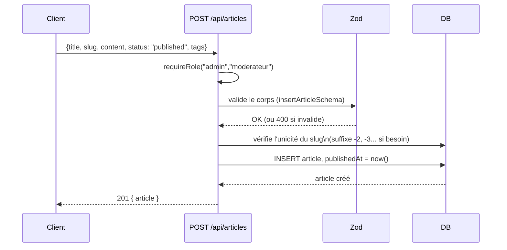

# Comment fonctionne l'API

Ce document explique les **principes** de l'API (comment s'authentifier, quelles conventions suivre). Pour la liste exhaustive des routes (méthode, accès, corps de requête/réponse), voir [`API.md`](../API.md) à la racine du dépôt — il est tenu à jour route par route et ce document ne le duplique pas.

## Principes généraux

- Toutes les routes sont préfixées par **`/api`**.
- Le corps des requêtes est en **JSON**, sauf les routes d'upload de fichiers qui utilisent `multipart/form-data` (avatar, bannière, couvertures de projet, pages de chapitre).
- Les réponses d'erreur suivent toujours la forme `{ "error": "message" }`, avec le code HTTP approprié :

| Code | Signification |
| --- | --- |
| `400` | Corps de requête invalide (échec de validation Zod) |
| `401` | Non authentifié (pas de cookie de session valide) |
| `403` | Authentifié, mais rôle/permission insuffisant |
| `404` | Ressource introuvable |
| `409` | Conflit (ex. slug déjà utilisé) |

## S'authentifier

Voir le diagramme de séquence dans [`architecture.md`](architecture.md#authentification). En résumé :

1. `POST /api/auth/login` (ou `/auth/register`) avec `{ username, password }`.
2. Le serveur répond avec un cookie `komamy_session` (httpOnly, JWT signé, expire après 7 jours).
3. **Chaque requête suivante doit inclure ce cookie** — en `fetch`, cela veut dire `credentials: "include"` (déjà géré par le client, voir `client/src/lib/api.ts`). Il n'y a rien à faire manuellement côté client une fois connecté.
4. `GET /api/auth/me` renvoie le profil de l'utilisateur courant, ou `401` si aucune session valide.

Il n'y a pas de refresh token : passé 7 jours, l'utilisateur doit simplement se reconnecter.

## Trois niveaux d'accès

| Niveau | Ce que ça veut dire |
| --- | --- |
| **Public** | Aucun cookie requis. |
| **Connecté** | Cookie de session valide requis (`requireAuth`) — peu importe le rôle. |
| **Rôle précis** | `requireRole("admin", "moderateur")` par exemple — 403 si le rôle du compte ne correspond pas. |

Voir [`roles-permissions.md`](roles-permissions.md) pour le détail de ce que chaque rôle peut faire, y compris la règle d'appartenance à une équipe qui s'applique aux routes `/admin/projects`.

## Upload de fichiers

Les routes qui acceptent des fichiers (`POST /auth/avatar`, `POST/PUT /admin/projects`, `POST/PUT /admin/projects/:slug/chapters/:id`) utilisent `multipart/form-data`. Deux subtilités à connaître :

- **Les tableaux structurés** (`authors`, `teams`, `externalLinks`, `tags` sur un projet) sont envoyés comme une **chaîne JSON** dans un champ du même nom, même en `multipart/form-data` — ce n'est pas un vrai tableau de champs HTML.
- **Les chapitres** acceptent soit plusieurs fichiers `images` (upload individuel), soit un unique fichier `zip` — jamais les deux à la fois. Voir [`guides/publier-un-chapitre.md`](guides/publier-un-chapitre.md) pour le détail (et une limitation actuelle du mode `images`).

Tous les fichiers uploadés sont servis statiquement sous `/uploads/*`, quel que soit leur type (avatar, couverture, page de chapitre).

## Exemple : créer un article

Ce schéma généralise à la plupart des routes de création (`POST /admin/projects`, `POST /admin/projects/:slug/chapters`...) : validation → vérification d'unicité si pertinent → écriture → réponse avec la ressource créée.

## Contrat public stable

Les formes `Public*` renvoyées par l'API (`PublicUser`, `PublicWebcomicProject`, `PublicArticle`...) sont **intentionnellement stables**, même si le schéma PostgreSQL sous-jacent évolue — c'est le rôle de la couche `db/services/*.services.ts` de faire cette traduction (au-dessus de `db/repositories/*.repository.ts`, qui ne fait que les requêtes brutes). Par exemple, `authorName`/`team` sur un projet représentent toujours le _premier_ crédit pour ne pas casser les vues compactes (cartes), même quand `authors`/`teams` (les tableaux complets) portent plusieurs crédits.