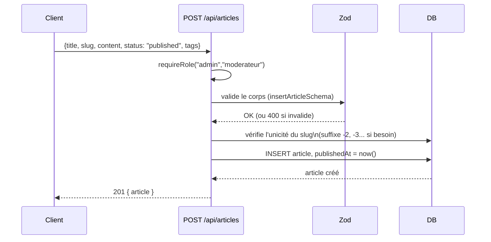

Toutes les routes sont préfixées par **`/api`**. Une spec OpenAPI générée (toutes les routes, 158 opérations) est disponible sur `GET /api/openapi.json`, avec une UI interactive sur `GET /api/docs` de n'importe quelle instance Komamy — cette page reste la référence complémentaire pour tout ce que le schéma seul ne capture pas explicitement (rôles, rate limiting, format d'erreur). Pour le détail route par route, voir la [Référence API](/developpeurs/api-reference).

## Conventions générales

- Le corps des requêtes est en **JSON**, sauf les routes d'upload de fichiers qui utilisent `multipart/form-data` (avatar, bannière, couvertures de projet, pages de chapitre).
- Les réponses d'erreur suivent toujours la forme `{ "error": "message" }`, avec le code HTTP approprié :

| Code | Signification |
| --- | --- |
| `400` | Corps de requête invalide (échec de validation Zod) |
| `401` | Non authentifié (pas de cookie de session valide) |
| `403` | Authentifié, mais rôle/permission insuffisant |
| `404` | Ressource introuvable |
| `409` | Conflit (ex. slug déjà utilisé) |
| `429` | Trop de requêtes (rate limiting, avec header `Retry-After`) |

<Note>
  Sur un `400` de validation, `message` est construit par `formatZodError` (`db/lib/validation.ts`) : chaque champ en erreur est listé (pas seulement le premier), préfixé par son chemin — ex. `teamId : Invalid input: expected number, received string · chapterIds : Sélectionnez au moins un chapitre à importer`.
</Note>

## Authentification

L'authentification repose sur un cookie httpOnly `komamy_session` (JWT signé, 7 jours). Il est posé automatiquement par `/auth/login` et `/auth/register`, et doit être transmis par le client sur toutes les requêtes (`credentials: "include"` en fetch).

<Steps>
  <Step title="S'inscrire ou se connecter">
    `POST /api/auth/register` ou `POST /api/auth/login` avec `{ username, password }`.
  </Step>
  <Step title="Cookie posé automatiquement">
    Le serveur répond avec un cookie `komamy_session` — rien à faire manuellement côté client une fois connecté.
  </Step>
  <Step title="Requêtes suivantes">
    `GET /api/auth/me` renvoie le profil courant, ou `401` si aucune session valide. Il n'y a pas de refresh token : passé 7 jours, l'utilisateur doit simplement se reconnecter.
  </Step>
</Steps>

### Trois niveaux d'accès

| Niveau | Ce que ça veut dire |
| --- | --- |
| **Public** | Aucun cookie requis. |
| **Connecté** | Cookie de session valide requis (`requireAuth`) — peu importe le rôle. |
| **Rôle précis** | `requireRole("admin", "moderateur")` par exemple — 403 si le rôle du compte ne correspond pas. |
| **Permission custom** | Logique au cas par cas — ex. `canManageProject` (staff, ou membre de l'équipe créditée), `assertIsTeamMember`/`assertCanEditTeam`/`assertCanManageMembers`/`assertCanDeleteTeam` (staff, ou membre/gérant/propriétaire selon l'action). |

Voir [Rôles et permissions](/guide-equipe/roles-et-permissions) pour ce que chaque rôle peut faire, y compris la règle d'appartenance à une équipe.

### Passkeys (WebAuthn)

En complément du mot de passe (jamais en remplacement), basé sur `@simplewebauthn/server`/`@simplewebauthn/browser`. Flux **discoverable** : la connexion ne demande pas de pseudo, le navigateur propose directement les passkeys enregistrées pour le site. Le RP ID et l'origine attendue sont dérivés dynamiquement de la requête (respecte un reverse proxy) — aucune configuration supplémentaire nécessaire pour l'opérateur self-hosted.

## Rate limiting

Certaines routes sensibles (auth, uploads, création de contenu communautaire, recherche) sont limitées en fréquence — dépassement : `429` avec un header `Retry-After` (secondes). Clé par IP sauf mention contraire ; `accountOrIpKey` = par compte connecté, sinon par IP.

| Route(s) | Fenêtre | Limite |
| --- | --- | --- |
| `POST /auth/register` | 1 h / IP | 10 |
| `POST /auth/login` | 15 min / IP | 20 |
| `POST /auth/login` | 15 min / nom d'utilisateur soumis | 8 |
| Uploads (`/auth/avatar`, `/auth/banner`, `/admin/*/avatar\|banner`, `/admin/projects*`) | 1 min / compte ou IP | 10 |
| Création de contenu (commentaires, tickets, feed d'équipe, agenda) | 1 min / compte ou IP | 20 |
| `GET /search` | 1 min / IP | 30 |
| `GET /search/suggest` | 1 min / IP | 90 |
| `GET /users/search` | 1 min / compte ou IP | 60 |
| `POST /chat/*/messages` | 1 min / compte ou IP | 30 |
| `DELETE /me/account` | 15 min / compte ou IP | 5 |
| `/admin/mangadex/import` | 1 min / compte ou IP | 5 |
| Outils d'image (`/tools/*`) | 1 min / compte ou IP | 5 (3 pour `/tools/upscale`) |

Désactivé pendant les tests d'intégration (`NODE_ENV=test`).

## Upload de fichiers

Les routes qui acceptent des fichiers (`POST /auth/avatar`, `POST/PUT /admin/projects`, `POST/PUT /admin/projects/:slug/chapters/:id`) utilisent `multipart/form-data`. Deux subtilités à connaître :

- **Les tableaux structurés** (`authors`, `teams`, `externalLinks`, `tags` sur un projet) sont envoyés comme une **chaîne JSON** dans un champ du même nom, même en `multipart/form-data` — ce n'est pas un vrai tableau de champs HTML.
- **Les chapitres** acceptent soit plusieurs fichiers `images` (upload individuel), soit un unique fichier `zip` — jamais les deux à la fois.

Tous les fichiers uploadés sont servis statiquement sous `/uploads/*`, quel que soit leur type.

## Contrat public stable

Les formes `Public*` renvoyées par l'API (`PublicUser`, `PublicWebcomicProject`, `PublicArticle`...) sont **intentionnellement stables**, même si le schéma PostgreSQL sous-jacent évolue — c'est le rôle de la couche `db/services/*.services.ts` de faire cette traduction (au-dessus de `db/repositories/*.repository.ts`, qui ne fait que les requêtes brutes). Par exemple, `authorName`/`team` sur un projet représentent toujours le **premier** crédit pour ne pas casser les vues compactes (cartes), même quand `authors`/`teams` (les tableaux complets) portent plusieurs crédits. Voir [Base de données](/developpeurs/base-de-donnees) pour le détail de cette couche.

## Exemple de flux d'écriture

Ce schéma généralise à la plupart des routes de création (`POST /admin/projects`, `POST /admin/projects/:slug/chapters`...) : validation → vérification d'unicité si pertinent → écriture → réponse avec la ressource créée.
