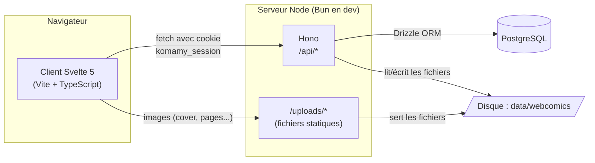
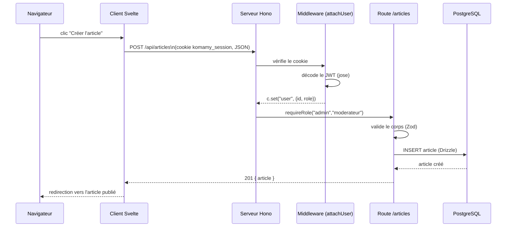
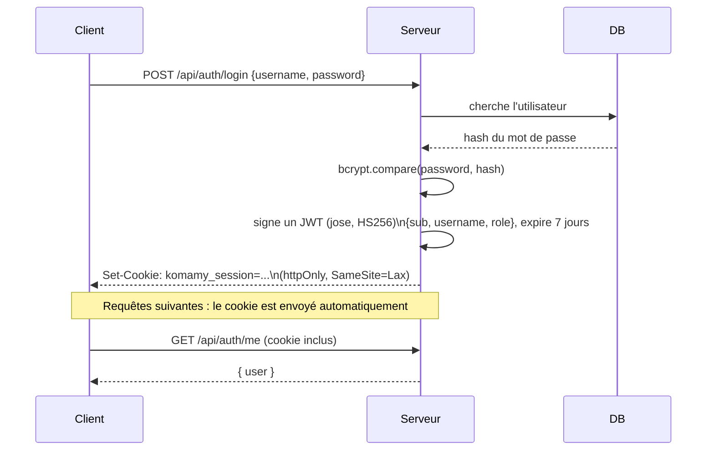

## Vue d'ensemble

Komamy est une application web classique en trois couches : un client **Svelte 5** (voir [Architecture client](/developpeurs/architecture-client) pour le détail), un serveur **Hono** qui expose une API REST, et une base **PostgreSQL** qui persiste tout (utilisateurs, projets, chapitres, articles, commentaires...). Les fichiers uploadés (images) sont stockés directement sur le disque du serveur, pas en base.



En développement (`bun run dev`), le client (Vite, port `5173`) et le serveur (Hono, port `3000`) tournent en parallèle : Vite proxifie les requêtes `/api` vers le serveur. En production, le serveur Hono sert directement les fichiers statiques du client buildé — un seul processus, un seul port.

## Le parcours d'une requête

Exemple concret : un modérateur clique sur « Créer l'article » dans l'éditeur.



Ce flux illustre les briques traversées par (presque) toutes les requêtes d'écriture :

1. **`attachUser`** (middleware global sur `/api/*`) : lit le cookie `komamy_session`, vérifie sa signature JWT, et attache l'utilisateur (ou rien, s'il n'est pas connecté) au contexte de la requête — sans jamais bloquer à ce stade.
2. **`requireAuth` / `requireRole(...)`** (middleware posé sur les routes qui en ont besoin) : bloque avec `401` si personne n'est connecté, ou `403` si le rôle ne convient pas.
3. **Validation Zod** : le corps de la requête est vérifié contre un schéma avant d'atteindre la base.
4. **Drizzle ORM** : traduit les opérations en SQL vers PostgreSQL.
5. **Couches `db/repositories/` et `db/services/`** (non représentées ci-dessus pour rester lisible) : les repositories exécutent les requêtes Drizzle brutes (une fonction = une requête), les services portent la logique métier et traduisent entre le schéma PostgreSQL normalisé et les formes « à plat » exposées par l'API — voir [Base de données](/developpeurs/base-de-donnees).

## Authentification

L'authentification repose sur un **JWT signé, stocké dans un cookie httpOnly** — pas de token à gérer manuellement côté client.



Le cookie étant `httpOnly`, le JavaScript du client ne peut pas le lire directement — c'est le navigateur qui le rattache automatiquement à chaque requête vers l'API (`credentials: "include"`). Voir [Rôles et permissions](/guide-equipe/roles-et-permissions) pour ce que chaque rôle peut faire une fois connecté, et [API — Vue d'ensemble](/developpeurs/api-overview#authentification) pour le détail technique (passkeys inclus).

## Structure des dossiers

```
komamy/
├── db/                    # Schéma PostgreSQL — la source de vérité de la persistance
│   ├── schema/            # Tables Drizzle (users, projects, articles, community...)
│   ├── types/enums.ts     # Enums Postgres (rôles, statuts...)
│   ├── repositories/      # Une fonction = une requête (pas de logique métier)
│   ├── services/          # Logique métier + traduction db/ (normalisé) ↔ shared/ (à plat)
│   └── validators/        # Schémas Zod
├── shared/                 # Contrat API : formes exposées au client, par domaine (projects.ts, users.ts...)
├── server/src/
│   ├── index.ts            # Point d'entrée (migrations + seed + démarrage)
│   ├── app.ts               # Composition Hono (middlewares, montage des routes)
│   ├── lib/                   # auth.ts (JWT/hash), webcomics.ts (upload de fichiers), tools/ (édition d'image)
│   ├── middleware/auth.ts      # attachUser, requireAuth, requireRole
│   └── routes/                  # /api/auth, /articles, /projects, /admin/*...
├── client/src/
│   ├── routes/               # Une page = une route (Home, Editor, Admin...)
│   └── lib/
│       ├── api.ts               # Client HTTP (fetch wrapper)
│       ├── actions/               # Hooks Svelte 5 réutilisables (*.svelte.ts)
│       ├── stores/                 # État global (auth, thème...)
│       └── components/              # Sidebar, cartes, formulaires partagés, par domaine
├── data/webcomics/          # Fichiers uploadés (couvertures, pages de chapitres)
└── drizzle/                  # Migrations SQL générées, versionnées avec le code
```

Détail complet du client (routage, TanStack Query, pattern de hooks, état partagé) : [Architecture client](/developpeurs/architecture-client). Pour l'installation et le déploiement, voir [Déploiement](/developpeurs/deploiement).
