PostgreSQL, via [Drizzle ORM](https://orm.drizzle.team). Le schéma vit dans `db/schema/*.ts` ; les enums partagés dans `db/types/enums.ts`. Toutes les tables ont un `id: bigserial` en clé primaire, sauf `site_config` (clé métier `key` en PK) et `user_preferences` (clé étrangère `userId` en PK, relation 1-1).

<Info>
  Le schéma PostgreSQL (normalisé, plusieurs tables liées) n'est **pas** directement ce que renvoie l'API. La traduction se fait en deux temps : `db/repositories/*.repository.ts` (une fonction = une requête Drizzle, pas de logique métier) puis `db/services/*.services.ts` (logique métier + traduction enum DB → valeur API, et assemblage des formes « à plat » exposées côté client). Voir [API — Vue d'ensemble](/developpeurs/api-overview).
</Info>

## Diagramme entité-relation (simplifié)

```mermaid
erDiagram
    USERS ||--o{ PROJECT_FAVORITES : "favorise"
    USERS ||--o{ PROJECT_RATINGS : "note"
    USERS ||--o{ READING_PROGRESS : "progresse"
    USERS ||--o{ USER_READING_ACTIVITY : "lit (par jour)"
    USERS ||--o{ PROJECT_COMMENTS : "commente"
    USERS ||--o{ TEAM_MEMBERS : "appartient à"
    USERS ||--o{ ARTICLES : "écrit (en tant qu'auteur)"
    USERS ||--o{ COLLECTIONS : "crée"
    USERS ||--o{ NOTIFICATIONS : "reçoit"
    USERS ||--o{ BLOG_POSTS : "publie"
    USERS ||--o{ BLOG_COMMENTS : "commente"
    USERS ||--o{ BLOG_AUTHOR_FOLLOWS : "suit"

    BLOG_POSTS ||--o{ BLOG_COMMENTS : "reçoit"
    BLOG_POSTS ||--o{ BLOG_POST_TAGS : "tague"
    BLOG_POSTS ||--o{ BLOG_POST_REACTIONS : "reçoit like de"
    BLOG_TAGS ||--o{ BLOG_POST_TAGS : "utilisé sur"

    PROJECTS ||--o{ PROJECT_CHAPTERS : "contient"
    PROJECTS ||--o{ PROJECT_AUTHORS : "crédite"
    PROJECTS ||--o{ PROJECT_TEAMS : "crédite"
    PROJECTS ||--o{ PROJECT_TAGS : "tague"
    PROJECTS ||--o{ PROJECT_COMMENTS : "reçoit"
    PROJECTS ||--o{ PROJECT_FAVORITES : "est favori de"
    PROJECTS ||--o{ PROJECT_RATINGS : "est noté par"
    PROJECTS ||--o{ COLLECTION_ITEMS : "figure dans"

    PROJECT_CHAPTERS ||--o{ CHAPTER_PAGES : "affiche"
    PROJECT_CHAPTERS ||--o{ CHAPTER_TEAMS : "crédite"
    PROJECT_CHAPTERS ||--o{ READING_PROGRESS : "suivi par"
    PROJECT_CHAPTERS ||--o{ CHAPTER_REACTIONS : "reçoit like de"

    AUTHORS ||--o{ PROJECT_AUTHORS : "crédité sur"
    TEAMS ||--o{ PROJECT_TEAMS : "créditée sur"
    TEAMS ||--o{ CHAPTER_TEAMS : "créditée sur"
    TEAMS ||--o{ TEAM_MEMBERS : "compte"
    TEAMS ||--o{ TEAM_POSTS : "publie"
    TEAMS ||--o{ TEAM_AGENDA_ENTRIES : "planifie"

    ARTICLES ||--o{ ARTICLE_TAGS : "tague"
    TAGS ||--o{ PROJECT_TAGS : "utilisé sur"
    TAGS ||--o{ ARTICLE_TAGS : "utilisé sur"

    USERS ||--o{ TICKETS : "ouvre"
    PROJECTS ||--o{ TICKETS : "concerne"
    PROJECT_COMMENTS ||--o{ TICKETS : "signalé par"

    USERS ||--o{ CHAT_PARTICIPANTS : "participe"
    CHAT_CONVERSATIONS ||--o{ CHAT_PARTICIPANTS : "réunit"
    CHAT_CONVERSATIONS ||--o{ CHAT_MESSAGES : "contient"

    COLLECTIONS ||--o{ COLLECTION_ITEMS : "regroupe"
```

## Tables par domaine

<AccordionGroup>
  <Accordion title="Utilisateurs" icon="user">
    | Table | Rôle |
    | --- | --- |
    | `users` | Comptes. `username` unique (3-50 caractères). `role` ∈ `USER \| MODERATOR \| ADMIN` (exposé côté API comme `lecteur \| moderateur \| admin`). `status` (`ACTIVE\|SUSPENDED\|DELETED`) existe en base mais n'est pas encore exploité par l'API. |
    | `user_preferences` | 1-1 avec `users`. Mode de lecture, largeur du lecteur (320-4000), espacement des pages, thème, contenu explicite, et `notificationSettings` (jsonb, préférences par type). |
    | `user_passkeys` | Un-à-plusieurs avec `users`. Une ligne par credential WebAuthn (`credentialId` unique globalement), clé publique COSE, compteur de signatures (détection de clonage), type d'appareil, transports. |
  </Accordion>
  <Accordion title="Webcomics" icon="book-open">
    | Table | Rôle |
    | --- | --- |
    | `projects` | Un projet webcomic. `status` (`ONGOING\|COMPLETED\|HIATUS\|LICENSED\|CANCELLED`) = avancement narratif ; `visibility` (`PUBLIC\|UNLISTED\|PRIVATE\|ARCHIVED`) détermine le `status: draft \| published` exposé côté API (`PRIVATE` → `draft`). `viewCount` = visites de la fiche. `downloadsEnabled` (déf. `false`) autorise le CBZ. `mangadexId` (nullable) lie ce projet à une série MangaDex si créé par import. |
    | `project_authors` / `project_teams` | Crédits M2M avec un rôle (`WRITER`, `TRANSLATOR`...) et un ordre d'affichage. |
    | `project_tags`, `project_links` | Tags et liens externes rattachés au projet. |
    | `project_chapters` | Un chapitre. `orderIndex` détermine sa position (unique par projet). `status` ∈ `DRAFT \| PUBLISHED \| HIDDEN`. `publisherTeamId` = crédit principal. `mangadexChapterId` (nullable, unique) = dédoublonnage d'import. |
    | `chapter_pages` | Les pages d'un chapitre, unique par (`chapterId`, `pageNumber`). |
    | `chapter_teams` | Crédits d'équipe **additionnels** sur un chapitre précis, distincts de `publisherTeamId`. |
    | `project_favorites`, `reading_progress`, `chapter_reactions` | Favoris, progression de lecture, likes par chapitre — propres à un utilisateur connecté. |
    | `project_ratings` | Note 1-5 étoiles sur un projet, une seule par utilisateur/projet, modifiable. |
    | `user_reading_activity` | Une ligne par jour où l'utilisateur a progressé dans au moins un chapitre — alimente le calendrier d'activité. |
  </Accordion>
  <Accordion title="Articles (Annonces)" icon="newspaper">
    | Table | Rôle |
    | --- | --- |
    | `articles` | `status` ∈ `DRAFT \| PUBLISHED \| ARCHIVED`. Un seul auteur obligatoire. `articleType` (`NEWS \| CHANGELOG`) distingue annonce et changelog ; `version` n'a d'effet d'affichage que pour `CHANGELOG`. |
    | `article_tags` | Tags M2M sur un article. |
    | `article_images` | Images additionnelles insérées dans le contenu d'un article. |
  </Accordion>
  <Accordion title="Auteurs, équipes, tags" icon="users">
    | Table | Rôle |
    | --- | --- |
    | `authors` | Fiche d'un⋅e auteur⋅rice (indépendante d'un compte `users` — ce sont des crédits, pas des comptes). |
    | `author_follows`, `author_links` | Suivi (notifications `NEW_AUTHOR_PROJECT`) et liens externes de fiche auteur. |
    | `teams` | Une équipe de scan/traduction. `mangadexGroupId` (nullable) = identifiant du groupe de scanlation MangaDex, renseignable uniquement par un admin/modérateur — garde-fou de l'import MangaDex. |
    | `team_members` | Rattache un `user` à une `team`, rôle `MEMBER \| MANAGER \| OWNER` en base — l'API n'expose aujourd'hui qu'un booléen `isManager`. |
    | `team_follows`, `team_links` | Suivi (notifications `NEW_TEAM_PROJECT`) et liens externes de fiche équipe. |
    | `tags` | Catalogue partagé articles/projets. `category` ∈ `GENRE \| TROPE \| DEMOGRAPHIC \| FORMAT \| CONTENT_WARNING`. Un tag `explicit: true` (avec `explicitReason`) est le mécanisme réel des avertissements de contenu structurés. |
  </Accordion>
  <Accordion title="Fil d'actualité d'équipe" icon="megaphone">
    | Table | Rôle |
    | --- | --- |
    | `team_posts` | `type` ∈ `ANNOUNCEMENT \| POLL`. Une annonce a un `content` markdown requis ; un sondage porte sa question dans `title`, ses options dans `team_poll_options`. |
    | `team_poll_options` | Options d'un sondage, ordonnées par `sortOrder`. |
    | `team_poll_votes` | Vote unique via `unique(postId, userId)` : revoter met à jour la ligne existante. |
    | `team_post_reactions` | Réaction (♥) sur un post — `unique(postId, userId)`, bascule ajout/retrait. |
    | `team_agenda_entries` | Dates de sortie annoncées. `projectId` nullable : une entrée peut exister avant même que le projet soit créé. |
  </Accordion>
  <Accordion title="Blog communautaire" icon="pen-tool">
    | Table | Rôle |
    | --- | --- |
    | `blog_posts` | Post publié par n'importe quel utilisateur connecté. `category` ∈ `GENERAL \| FAN_ART \| THEORIES \| ENTRAIDE \| HORS_SUJET` (fixe, défini au niveau code). Modération réversible (`isHidden`, `deletedAt`). |
    | `blog_tags` | Tags libres — distincts de `tags` (catalogue éditorial administré) : créés à la volée. |
    | `blog_post_tags` | Jointure M2M post ↔ `blog_tags`. |
    | `blog_post_reactions` | Likes sur un post de blog, unique par (post, utilisateur). |
    | `blog_comments`, `blog_comment_reactions`, `blog_comment_edits` | Commentaires imbriqués (un niveau), leurs likes, et l'historique d'édition. |
    | `blog_author_follows` | Suivi d'un **compte utilisateur** (auteur de posts) — distinct de `author_follows` (fiche `authors`, créateur de webcomic). Contrainte `CHECK` interdisant de se suivre soi-même. |
  </Accordion>
  <Accordion title="Communauté" icon="message-circle">
    | Table | Rôle |
    | --- | --- |
    | `project_comments` | Commentaires sur un projet, réponses en fil (`parentCommentId`, un niveau), modération réversible. `chapterId` (nullable) distingue un commentaire de chapitre d'un commentaire de projet général. |
    | `comment_reactions` | Likes sur un commentaire de projet, unique par (commentaire, utilisateur). |
    | `project_comment_edits` | Historique des versions d'un commentaire édité. |
    | `article_comments`, `article_comment_reactions`, `article_comment_edits` | Équivalents pour les commentaires sur un article. |
    | `tickets` | Demandes de support/signalements. `topic` ∈ `BUG \| ACCOUNT \| SERIES \| SUGGESTION \| OTHER` (déf. `OTHER`) — seul `SERIES` a un `projectId` pertinent côté formulaire. `attachmentUrl` (nullable) porte une capture d'écran jointe. `projectId` nullable (`onDelete: set null`). `commentId` (nullable) permet de signaler un commentaire précis. `staffId` = agent assigné. Ouvre automatiquement un canal `SUPPORT`. |
    | `chat_conversations` / `chat_participants` / `chat_messages` | Messagerie : conversations `DIRECT` (1:1), `GROUP` (équipe) ou `SUPPORT` (ticket). Suppression de message toujours douce (`deletedAt`). |
  </Accordion>
  <Accordion title="Collections" icon="folder">
    | Table | Rôle |
    | --- | --- |
    | `collections` | Collection thématique créée par un utilisateur. `isPublic` (déf. `true`) — une collection privée reste visible uniquement par son propriétaire. |
    | `collection_items` | Jointure collection ↔ projet, unique par (collection, projet), horodatée. |
  </Accordion>
  <Accordion title="Notifications" icon="bell">
    | Table | Rôle |
    | --- | --- |
    | `notifications` | Table volontairement dénormalisée : `title`/`body` sont déjà le texte final, `link` porte directement la route client à ouvrir. `type` ∈ `NEW_CHAPTER \| COMMENT_REPLY \| MESSAGE_RECEIVED \| TICKET_UPDATE \| NEW_TEAM_PROJECT \| NEW_AUTHOR_PROJECT \| NEW_BLOG_POST`. |

    Il n'y a pas de table dédiée aux préférences de notification : elles vivent dans `user_preferences.notificationSettings` (jsonb) — modèle clairsemé où l'absence d'une clé (ou `true`) vaut « activé », seul `false` désactive explicitement un type.
  </Accordion>
  <Accordion title="Succès (achievements)" icon="award">
    Il n'y a **pas de table `achievements`**. Le catalogue de succès est statique, défini dans `db/services/achievements.services.ts` (et `teamAchievements.services.ts` pour les succès d'équipe) ; chaque succès est calculé à la volée par agrégation sur les tables existantes (`reading_progress`, `project_chapters`, `project_tags`, `project_comments`, `project_favorites`...) plutôt que stocké.
  </Accordion>
  <Accordion title="Configuration" icon="settings">
    | Table | Rôle |
    | --- | --- |
    | `site_config` | Clé/valeur JSON (`key` en PK). Sert entre autres à stocker les projets mis en avant (`featured_project_ids`) et les blocs de la page d'accueil. |
  </Accordion>
  <Accordion title="Rôles et permissions granulaires" icon="shield-check">
    Système façon Discord : des rôles portent un bitfield de permissions (`bigint`), combinables par utilisateur/membre — voir `shared/permissions.ts` pour le catalogue de flags (`GLOBAL_FLAGS`/`TEAM_FLAGS`) et [Rôles et permissions](/guide-equipe/roles-et-permissions) côté fonctionnel.

    | Table | Rôle |
    | --- | --- |
    | `roles` | Rôles globaux (site entier). 3 lignes intégrées (`is_builtin = true` : Admin/Modérateur/Lecteur), protégées de la suppression/du renommage — leurs bits restent modifiables. `permissions` est un `bigint` (bits combinés par OR). |
    | `user_roles` | Jointure `users` ↔ `roles` — un utilisateur peut porter plusieurs rôles, ses droits sont l'union. |
    | `team_roles` | Rôles propres à une équipe. 3 lignes intégrées par équipe (Owner/Manager/Member), semées à la création de l'équipe. |
    | `team_member_roles` | Jointure `team_members` ↔ `team_roles` (liée à `team_members.id`, pas directement `teamId`/`userId` — le départ d'un membre fait cascader la suppression de ses rôles). |
    | `project_member_overrides` | Dérogation `allow`/`deny` (bitfields d'équipe) pour un utilisateur sur un projet précis — dernière couche de résolution, `deny` gagne sur `allow`. Unique par (`projectId`, `userId`). |

    <Warning>
      `users.role` et `team_members.role` (les anciens enums simples) **coexistent** avec ce système pendant la période de transition — toute écriture passe par une double-écriture (`db/services/users.services.ts`/`teams.services.ts`) pour garder les deux synchronisés. Une migration de données (`drizzle/20260906083515_crazy_the_hand/migration.sql`) construit `roles`/`user_roles`/`team_roles`/`team_member_roles` à partir des données existantes au moment où elle s'exécute — voir la mise en garde sur le bootstrap admin dans [Contribuer](/developpeurs/contribuer#points-dattention-du-système-de-permissions).
    </Warning>
  </Accordion>
  <Accordion title="Sécurité du compte : sessions, 2FA, récupération, audit" icon="lock">
    | Table | Rôle |
    | --- | --- |
    | `sessions` | Une ligne par session émise (mot de passe, passkey ou TOTP). Le JWT porte `id` comme claim `sid` : sa validité dépend de cette ligne (`revokedAt`/`expiresAt`), pas seulement de la signature — c'est ce qui permet de révoquer un appareil précis avant l'expiration du token. `deviceName` dérivé du user-agent, jamais d'IP stockée. |
    | `user_totp` | L'existence d'une ligne pour un utilisateur signifie « 2FA activée » — pas d'état « en attente » en base, le secret d'un enrôlement non confirmé vit dans un cookie signé temporaire. `secret` stocké en clair (base32), comme le secret JWT : doit rester réversible côté serveur. |
    | `recovery_codes` | Lot de codes à usage unique par utilisateur, hashés comme un mot de passe. Régénérer un lot supprime entièrement l'ancien. Un code consommé reste en base (`usedAt` renseigné) plutôt que d'être supprimé, pour l'audit. |
    | `audit_log` | Historique des actions sensibles (voir `shared/auditLog.ts` pour le catalogue fermé d'actions). `actorUserId`/`targetUserId` passent à `null` (`ON DELETE SET NULL`) si le compte est supprimé — l'entrée elle-même n'est jamais effacée, `metadata` conserve le pseudo au moment des faits. |
  </Accordion>
</AccordionGroup>

## Enums API vs enums PostgreSQL

Les valeurs exposées par l'API diffèrent volontairement de certains enums PostgreSQL bruts (la traduction se fait dans `db/services/*.services.ts`) :

| Domaine | Enum PostgreSQL | Valeur API |
| --- | --- | --- |
| Rôle utilisateur | `ADMIN \| MODERATOR \| USER` | `admin \| moderateur \| lecteur` |
| Statut de publication d'un projet | dérivé de `visibility` (`PUBLIC\|UNLISTED\|PRIVATE\|ARCHIVED`) | `draft` (si `PRIVATE`) `\| published` (sinon) |
| Statut de ticket | `OPEN \| IN_PROGRESS \| PENDING \| RESOLVED \| CLOSED` | `open \| in_progress \| pending \| resolved \| closed` |
| Priorité de ticket | `LOW \| MEDIUM \| HIGH \| URGENT` | `low \| medium \| high \| critical` |
| Thème | `LIGHT \| DARK \| SEPIA \| MIDNIGHT \| SYSTEM` | `light \| dark \| sepia \| midnight` — `SYSTEM` retombe sur `light` |

Le statut d'avancement de la série (`seriesStatus`), les rôles de crédit (`ProjectAuthorRole`, `ProjectTeamRole`) et les catégories de tag sont exposés tels quels, sans renommage.

Pour tout le reste (routes, formes de réponse), voir [API — Vue d'ensemble](/developpeurs/api-overview) et la [Référence API](/developpeurs/api-reference).
