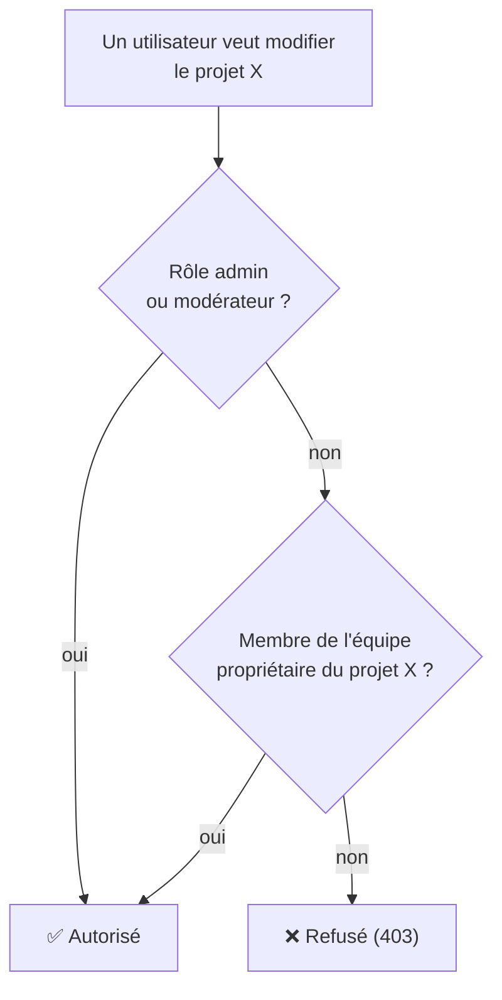

Trois rôles de compte, plus une règle moins visible mais essentielle : **l'appartenance à une équipe donne des droits d'édition sur les projets de cette équipe, quel que soit le rôle du compte.**

## Les trois rôles

| Rôle | Peut faire |
| --- | --- |
| **admin** | Tout : utilisateurs, articles, webcomics/chapitres, auteurs, équipes, tags, tickets, paramètres du site. Seul rôle pouvant **supprimer** (projet, chapitre, équipe, auteur, tag, utilisateur, article, ticket). |
| **modérateur** | Comme `admin`, sauf la gestion des comptes utilisateurs et les paramètres du site. Ne peut pas supprimer la plupart des ressources (réservé à `admin`), à l'exception de ses propres commentaires/messages. |
| **lecteur** | Rôle par défaut à l'inscription. Lecture, favoris, historique, likes, commentaires, tickets, messagerie — **et gestion des projets d'une équipe dont il est membre** (voir ci-dessous). |
| *Visiteur anonyme* | Lecture du contenu publié uniquement. Toute action d'écriture nécessite une connexion. |

## La règle qui surprend : membre d'équipe = droit d'édition

Un compte **lecteur** qui est **membre d'une équipe** (même simple membre, pas nécessairement gérant) peut créer et modifier les **projets et chapitres appartenant à cette équipe** — exactement comme un `admin` ou un `modérateur` le ferait. C'est ce qui permet à une équipe de scan/traduction de gérer sa propre série sans que chaque traducteur ait besoin d'un compte modérateur.

Cette règle a une implication pratique pour l'onglet **Webcomics** de l'administration : contrairement aux onglets Articles, Auteurs ou Tags (réservés à `admin`/`modérateur`), l'onglet Webcomics est accessible à **tous les rôles connectés**, y compris `lecteur` — la liste affichée est simplement filtrée aux projets que l'utilisateur a le droit de gérer.

<Note>
  Nuance : la distinction Membre/Gérant/Propriétaire au sein d'une équipe (voir [Gérer une équipe](/guide-equipe/gerer-une-equipe)) n'a **aucun effet** sur ce droit d'édition — un simple membre a exactement les mêmes droits qu'un gérant sur les projets de son équipe. Seule la **suppression** reste réservée à `admin`, même pour un membre d'équipe.
</Note>

## Récapitulatif par action

| Action | admin | modérateur | lecteur (hors équipe) | lecteur (membre de l'équipe) |
| --- | --- | --- | --- | --- |
| Créer/éditer un article | ✅ | ✅ | ❌ | ❌ |
| Supprimer un article | ✅ | ❌ | ❌ | ❌ |
| Créer/éditer un projet webcomic | ✅ | ✅ | ❌ | ✅ (projets de son équipe) |
| Ajouter un chapitre | ✅ | ✅ | ❌ | ✅ (projets de son équipe) |
| Supprimer un projet/chapitre | ✅ | ❌ | ❌ | ❌ |
| Gérer les utilisateurs | ✅ | ❌ | ❌ | ❌ |
| Gérer les équipes/auteurs/tags | ✅ | ✅ | ❌ | ✅ (sa propre équipe) |
| Modérer les commentaires | ✅ | ✅ | ❌ | ❌ |
| Traiter les tickets | ✅ | ✅ | ❌ | ❌ |
| Paramètres du site | ✅ | ❌ | ❌ | ❌ |
| Importer des chapitres depuis MangaDex | ✅ | ✅ | ❌ | ❌ (même gérant de l'équipe) |
| Définir le groupe MangaDex d'une équipe | ✅ | ✅ | ❌ | ❌ (même gérant de l'équipe) |

<Warning>
  L'import MangaDex et le champ « groupe MangaDex » d'une équipe sont volontairement **hors** de la règle « membre d'équipe = droit d'édition » ci-dessus : un membre d'équipe (même gérant) n'y a aucun accès, réservé à `admin`/`modérateur`. Voir [Importer depuis MangaDex](/guide-equipe/importer-depuis-mangadex).
</Warning>

Pour le détail route par route (quel contrôle d'accès s'applique où), voir la [référence API](/developpeurs/api-reference).
